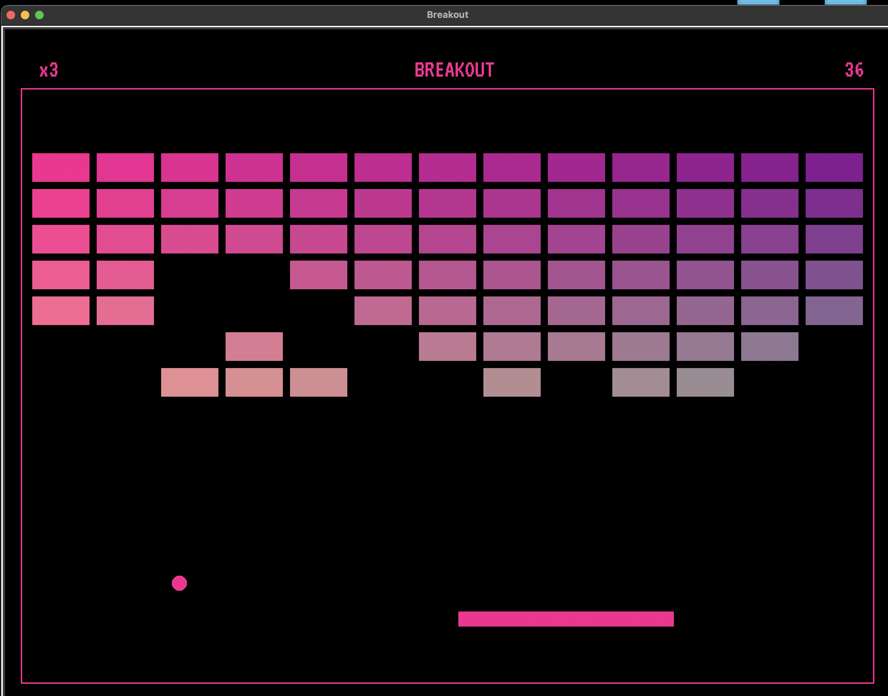

# 100 Days of Code: The Complete Python Pro Bootcamp for 2023 - Day 87 - Breakout Game

This is my solution to the [Breakout game](https://www.udemy.com/course/100-days-of-code/).

## Table of contents

- [Overview](#overview)
  - [The challenge](#the-challenge)
  - [Screenshot](#screenshot)
  - [Built with](#built-with)
  - [What I learned](#what-i-learned)
- [Author](#author)

## Overview

### The challenge

Recreate Breakout. Breakout was a hit game originally coded up by Steve Wozniak before he and Jobs started Apple. It's a simple game that is similar to Pong where you use a ball and paddle to break down a wall.

### Screenshot

#### Start

#### In game

#### Pause

#### More in game

#### Game Over

### Built with

- python3
- turtle

### What I learned

This project was a good follow up to the previous project and continued to demonstrate my progression as a developer. Python is still a new language for me and I have only used turtle in the context of small class type assignments. I am learning and experiencing that sometimes one of the problems that need to be solved is my own lack of understanding of the language or library I am using to solve other problems. That is what I've found both really challenging and really rewarding about becoming developer. Each new project kind of hits me in the face with the reality that I do not know what I am doing, but pressing forward, slowly a new reality is created and I have a tool I can use, or build upon later.

## Author

- Website - [my site](https://rugh.us)
- Frontend Mentor - [@roodhouse](https://www.frontendmentor.io/profile/roodhouse)
- LinkedIn - [John Rugh](https://www.linkedin.com/in/john-m-rugh/)
